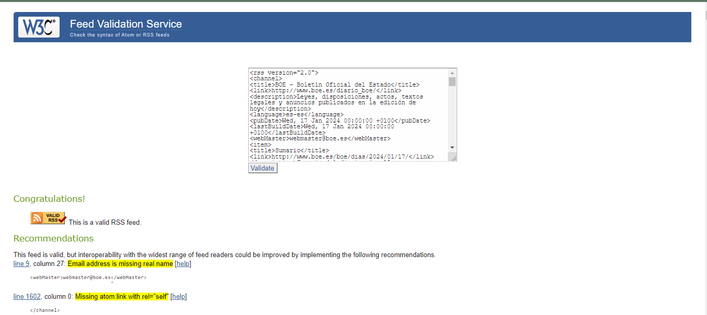

# UD4A1
## José María Mayén  y Manuel Ortiz - - - - - - - - - - - - - - - 1º DAW
### 1. Añade varias fuentes relacionadas con un tema personal y original
Iniciamos seseion en feedly y vamos a añadir varios temas de interes

Empezamos añadiendo Marca Baloncesto

Añadimos el BOE

Terminamos añadiendo Filmin Blog

Se nos quedaria algo asi

### 2. Añade a la categoría de noticias
- Añade al menos 3 fuentes relacionadas con las noticias. 
 
### 3. Añade la fuente de una administración concreta

### 4. De cualquiera de las fuentes encontradas extrae los ficheros XML con formato rss o atom y súbelos al repositorio.
- Fichero rss
  XML BOE

[BOE](boe.php)

- Fichero atom

[Wired](wired%20atom.rss)

### 5. Toma cada uno de los ficheros RSS y comprueba su validez
- Fichero rss válido
  - fuente
  - imagen validator

  

- Fichero atom
  - fuente
  - imagen validator
  
  
### 6. Haz un listado de las etiquetas principales, debidamente organizadas
- Fichero rss
  
channel, item, title, link, description.

- Fichero atom

channel, item, atom:link, category.